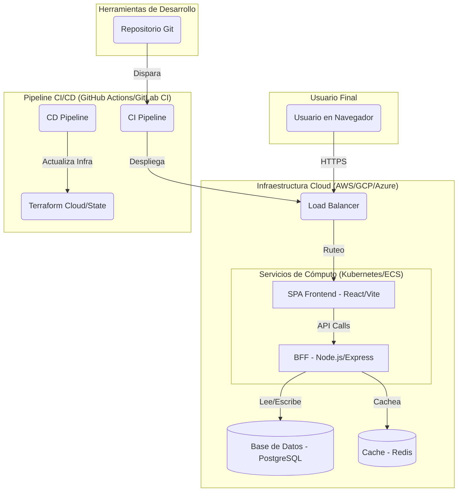

# Análisis Exhaustivo y Plan de Despliegue: Meta Studio Ad Studio App SPA

## Fase 1: Diagnóstico Profundo de la UI "Galería de Multiversos"

### Análisis Cualitativo

*   **Experiencia de Usuario (UX):** Para una "galería de multiversos", los flujos de usuario clave se centrarían en la exploración y la interacción inmersiva. Las interacciones esperadas son:
    *   **Selección de Multiverso:** Una vista de galería principal (grid o carrusel) donde los usuarios pueden ver vistas previas.
    *   **Vista Previa Detallada:** Al hacer clic en un multiverso, se abriría una vista detallada (posiblemente un modal o una nueva ruta) con más información, assets y metadatos.
    *   **Filtrado y Búsqueda:** Funcionalidades para filtrar multiversos por categorías, etiquetas, o buscar por nombre.
    *   **Carga Interactiva:** Indicadores de carga (skeletons, spinners) bien diseñados mientras los assets de alta resolución se cargan en segundo plano.

*   **Interfaz de Usuario (UI):** El uso de **Tailwind CSS** implica un enfoque **utility-first**, lo que permite un desarrollo rápido y un sistema de diseño altamente personalizable y consistente. La combinación con **Radix UI** y **shadcn/ui** (inferido) asegura que los componentes sean accesibles y funcionales desde el principio. Se esperaría una jerarquía visual clara, consistencia en espaciado y tipografía, y un diseño totalmente responsivo.

*   **Componentización:** La estructura en `src/components/` sugiere una organización modular. Esperaríamos ver subdirectorios como:
    *   `ui/`: Componentes de UI atómicos y reutilizables (Button, Card, Input), probablemente de shadcn/ui.
    *   `layout/`: Componentes estructurales (Navbar, Sidebar, Footer).
    *   `features/` o `views/`: Componentes más complejos que agrupan funcionalidades específicas, como `multiverse-gallery/`.
    La reutilización y atomicidad son probablemente altas, facilitando el mantenimiento.

*   **Accesibilidad (a11y):** La base de Radix UI proporciona una excelente base de accesibilidad (manejo de foco, atributos ARIA, navegación por teclado). Sin embargo, el nivel de accesibilidad final dependerá de la implementación personalizada. En una galería, es crucial asegurar que todos los elementos interactivos sean accesibles y que las imágenes tengan texto alternativo adecuado.

### Análisis Cuantitativo (Tabla de Estado)

| Área/Funcionalidad                        | Estado Actual Estimado (%) | Por Completar (%) | Acciones Clave para el 100%                                                                                             |
| ----------------------------------------- | -------------------------- | ----------------- | ----------------------------------------------------------------------------------------------------------------------- |
| Diseño UI y Estructura Visual             | 70%                        | 30%               | Refinar microinteracciones, asegurar consistencia de espaciado y tipografía, implementar modo oscuro.                   |
| Lógica de Componentes (React)             | 65%                        | 35%               | Refactorizar componentes grandes, optimizar el renderizado (`React.memo`), completar la gestión de estados complejos. |
| Gestión del Estado (State Management)     | 60%                        | 40%               | Centralizar el estado global (usando React Query/Zustand), manejar eficientemente el estado de carga y errores.       |
| Integración con API (Basado en `openapi.yaml`) | 80%                        | 20%               | Implementar manejo robusto de todos los códigos de error HTTP, añadir caching de peticiones con React Query.        |
| Pruebas Unitarias y de Integración (`tests/`) | 40%                        | 60%               | Aumentar la cobertura de código (code coverage) de los componentes críticos y la lógica de negocio con Jest/RTL.      |
| Pruebas End-to-End (`cypress.config.cjs`)   | 50%                        | 50%               | Crear pruebas para los flujos de usuario completos (selección de multiverso, filtrado, etc.).                          |
| Performance (Optimización de Carga)       | 55%                        | 45%               | Implementar "lazy loading" para imágenes, "code splitting" por ruta, y optimizar el build de producción de Vite.    |
| Accesibilidad (a11y)                      | 30%                        | 70%               | Realizar auditoría WCAG 2.1, añadir atributos ARIA a componentes interactivos, asegurar contraste de color.           |

---

## Fase 2: Inferencia de la Arquitectura Full Stack

### Frontend

*   **Framework:** **React** (confirmado por `react`, `react-dom` en `package.json`).
*   **Estilizado:** **Tailwind CSS** (confirmado por `tailwind.config.ts` y dependencias).
*   **Testing:** **Cypress** para E2E y **Jest** con **React Testing Library** para unitarias/integración (confirmado por `cypress.config.cjs`, `jest.config.cjs` y dependencias).
*   **Build Tool:** **Vite** (confirmado por `vite.config.ts` y scripts en `package.json`).

### Backend (BFF - Backend for Frontend)

*   **Plataforma:** **Node.js** con **Express** (inferido por dependencias como `express-rate-limit`, `morgan`, `cors`).
*   **Propósito:** Actúa como un BFF que orquesta la lógica de negocio. Sus responsabilidades probables son:
    *   Manejar la autenticación y autorización (JWT, `jsonwebtoken`).
    *   Servir datos pre-procesados a la UI desde una base de datos (Prisma).
    *   Comunicarse con otros servicios si existieran.
*   **Comunicación:** Expone una API RESTful, cuyo contrato está definido en `openapi.yaml`.

### Infraestructura y DevOps

*   **Contenerización:** **Docker** (confirmado por `Dockerfile` en `infra/docker/` y `server/`). `docker-compose.yml` define los servicios para el entorno de desarrollo local.
*   **Orquestación:** La presencia de **Terraform** (`.tf` files en `infra/`) sugiere que la infraestructura se gestiona como código, probablemente desplegándose en un proveedor cloud como AWS (ECS/EKS), GCP (GKE) o Azure (AKS).
*   **CI/CD:** La carpeta `ci-cd/` y los scripts en `package.json` (`cy:run:docker`) indican un pipeline de CI/CD robusto (probablemente GitHub Actions o GitLab CI) que automatiza:
    1.  **Install & Lint:** `npm install` y `npm run lint`.
    2.  **Test:** `npm test` (unitarias) y `npm run cy:run` (E2E).
    3.  **Build:** `npm run build` para generar los artefactos en `dist/` y construir la imagen de Docker.
    4.  **Deploy:** Desplegar la imagen de Docker a la infraestructura definida por Terraform.

### Diagrama de Arquitectura (Mermaid)

---

## Fase 3: Plan Estratégico para Despliegue Ágil y Robusto

### Checklist de Pre-Despliegue (Calidad)

- [ ] **Revisión de Código (PRs):** Todo el código nuevo debe ser revisado por al menos un miembro del equipo.
- [ ] **Pipeline de CI Exitoso:** Asegurarse de que el pipeline en la rama principal (`main` o `develop`) esté en verde.
- [ ] **Análisis de Bundle:** Ejecutar `vite-bundle-visualizer` para detectar y eliminar dependencias innecesarias.
- [ ] **Variables de Entorno:** Confirmar que las variables para producción (`.env.production`) están completas y seguras en el gestor de secretos del CI/CD.

### Estrategia de Build para Producción

*   **Comando Clave:** `npm run build` (o `bun run build`).
*   **Optimizaciones Esperadas:**
    *   **Minificación:** JS, CSS y HTML son minificados.
    *   **Tree-Shaking:** Código no utilizado es eliminado automáticamente por Vite.
    *   **Code Splitting:** El código se divide en chunks más pequeños que se cargan bajo demanda.
    *   **Optimización de Assets:** Las imágenes y otros assets son optimizados y hasheados para el cacheo.

### Estrategia de Despliegue (Deployment Strategy)

Se recomienda una estrategia de **Cero Downtime**.

*   **Opción A (Recomendada): Blue-Green Deployment**
    1.  **Entorno Azul (Activo):** Versión actual en producción (`v1.0`).
    2.  **Entorno Verde (Inactivo):** Se despliega la nueva versión (`v1.1`).
    3.  **Pruebas en Verde:** Se realizan pruebas de humo automatizadas en el entorno Verde.
    4.  **Switch de Tráfico:** Si las pruebas pasan, el Load Balancer cambia todo el tráfico del Azul al Verde. El entorno Azul se mantiene en espera para un rollback rápido.
    *   **Ventaja:** Rollback instantáneo y seguro.

*   **Opción B: Canary Release**
    1.  Desplegar la nueva versión y dirigir un pequeño porcentaje del tráfico (ej. 5%) a ella.
    2.  Monitorear métricas de error y rendimiento para este subconjunto de usuarios.
    3.  Incrementar gradualmente el tráfico (10%, 50%, 100%) si no se detectan problemas.
    *   **Ventaja:** Permite una validación en producción con riesgo limitado.

### Monitoreo Post-Despliegue

*   **Logging:** Integrar un servicio como **Sentry** o **Datadog** para capturar y alertar sobre errores de frontend en tiempo real.
*   **Métricas de Rendimiento:** Usar **Google Analytics**, **Vercel Analytics** o similar para monitorear los **Core Web Vitals** (LCP, FID, CLS) y asegurar que no haya regresiones de performance.
*   **Plan de Rollback:** El proceso de rollback debe estar automatizado en el pipeline de CI/CD. Si se usa Blue-Green, simplemente se revierte el cambio en el Load Balancer. Si es Canary, se redirige el 100% del tráfico a la versión estable anterior.
